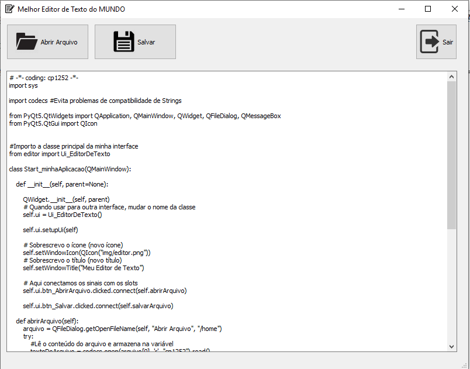

# Melhor editor de código/texto do MUNDO
> Editor de código/texto desenvolvido com Python 3 e QT5 (PyQT5)


Este editor de código/texto foi desenvolvido com o intuito de ensinar __PyQT5__ aos participantes do minicurso "_Interfaces gráficas com PyQT5_", ministrado por mim no SEMITI 2019, do IFPB.



## Pré-requisitos

Python 3.x 


PyQT5:

```sh
pip3 install pyqt5
```

## Funcionalidades

- Criar e editar códigos/textos (quem diria, heim?)
- Abrir arquivos já existentes
- Salvar arquivo no formato .py e .txt
- Ensinar aos participantes deste minicurso PyQT5 (acho que essa é a mais importante) 

